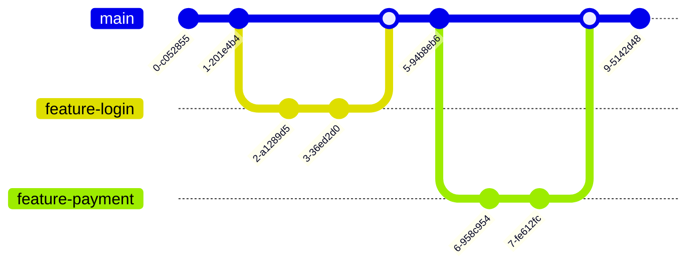

Git is the backbone of modern software development, yet many developers only scratch the surface. We memorize `git add`, `git commit`, and `git push`, but what happens when things go wrong? Or when you need to maintain a clean history in a complex project?

This guide moves beyond the basics to explore the powerful tools that make Git a true productivity powerhouse.


## 1. Interactive Rebase: Rewriting History

**The Concept:** `git rebase -i` allows you to modify, squash, or delete commits before they are shared with the team. It's about telling a clean story.

> **Real-Life Scenario:**
> You're working on a "Login Feature". Over three days, you make 5 commits:
>
> - "start login"
> - "wip"
> - "fix typo"
> - "wip again"
> - "finish login"
>
> **The Problem:** Merging this into `main` creates a messy history that's hard to read.
>
> **The Solution:** Use interactive rebase to **squash** all 5 commits into one clean commit named "Feature: User Login Implementation".

```bash
# Rebase the last 5 commits
git rebase -i HEAD~5
```

In the editor that opens, change `pick` to `squash` (or `s`) for the commits you want to combine.

## 2. Cherry-Picking: Surgical Precision

**The Concept:** `git cherry-pick` allows you to take a specific commit from one branch and apply it to another.

> **Real-Life Scenario:**
> You have a `main` branch (v2.0 development) and a `stable` branch (v1.0 production). A critical security bug is found in production. You fix it on `main` because that's where you're working.
>
> **The Problem:** You need that specific fix in `stable` immediately, but you _cannot_ merge `main` because it contains unfinished v2.0 features.
>
> **The Solution:** Cherry-pick the bug fix commit.

```bash
# Switch to the target branch
git checkout stable

# Apply the specific commit
git cherry-pick <commit-hash>
```

## 3. The Safety Net: Git Reflog

**The Concept:** `git reflog` is your undo button for "irreversible" mistakes. It tracks every movement of the `HEAD` pointer, even if you deleted a branch or reset a commit.

> **Real-Life Scenario:**
> You're tired. You accidentally run `git reset --hard HEAD~3` and wipe out your last 3 hours of work. You panic.
>
> **The Solution:** Check the reflog.

```bash
git reflog
# Output:
# 8f3a1b2 HEAD@{0}: reset: moving to HEAD~3
# 4c2d1e5 HEAD@{1}: commit: finished header component
```

You see that `4c2d1e5` was your commit before the reset. You can restore it:

```bash
git reset --hard 4c2d1e5
```

## 4. Bisect: Finding the Needle in the Haystack

**The Concept:** `git bisect` uses a binary search algorithm to find the exact commit that introduced a bug.

> **Real-Life Scenario:**
> The build is failing. It was working fine last week, but there have been 50 commits since then. You have no idea which one broke it.
>
> **The Solution:** Don't check them one by one. Use bisect.

```bash
git bisect start
git bisect bad            # Current version is bad
git bisect good v1.0.0    # Last week's version was good
```

Git will automatically checkout the middle commit. You test it. If it works, type `git bisect good`. If it fails, type `git bisect bad`. Git keeps cutting the list in half until it finds the culprit in seconds.

## Visualizing the Workflow

Understanding how branches interact is key. Here's a look at a standard Feature Branch workflow:



## Conclusion

Mastering these advanced Git commands transforms you from a user who fears conflicts into a master of the codebase. Whether it's saving lost work with `reflog` or keeping history clean with `rebase`, these tools are essential for any serious developer.

Start practicing them today (maybe on a test repo first!) and watch your confidence soar.
