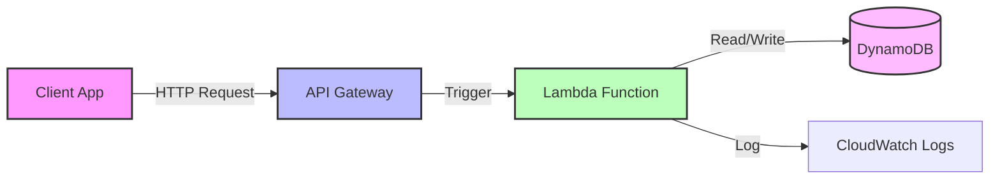

In the ever-evolving landscape of cloud computing, **Serverless Architecture** has emerged as a paradigm shift, not just a buzzword. It promises to liberate developers from the shackles of infrastructure management, allowing them to focus purely on code. But what exactly is it, and is it right for your next project?


## What is Serverless?

Contrary to its name, "serverless" doesn't mean there are no servers. It simply means that the servers are abstracted away. You, as a developer, don't provision, manage, or scale them. A cloud provider (like AWS, Azure, or Google Cloud) handles all of that for you.

Serverless typically encompasses two main concepts:

1.  **FaaS (Function as a Service):** This is the core compute component. You write small, single-purpose functions (e.g., AWS Lambda, Azure Functions) that are triggered by events.
2.  **BaaS (Backend as a Service):** Third-party services that replace server-side components, such as authentication (Auth0, Firebase Auth) or databases (DynamoDB, Firestore).

## Deep Dive: How it Works

Serverless is inherently **event-driven**. A function sleeps until it's woken up by an event—an HTTP request, a file upload, a database change, or a scheduled timer.

### The Lifecycle of a Request

1.  **Trigger:** An event occurs (e.g., a user uploads a photo).
2.  **Spin-up:** The cloud provider allocates a container to run your function code.
3.  **Execution:** The code runs, processes the event, and returns a result.
4.  **Teardown:** After a period of inactivity, the container is destroyed to free up resources.

### Cold vs. Warm Starts

- **Cold Start:** When a function is invoked for the first time (or after being idle), the provider must spin up a new container. This adds latency (typically 100ms to a few seconds).
- **Warm Start:** If a container is already active from a previous request, it's reused, resulting in near-instant execution.

## Key Benefits & Real-Life Examples

### 1. Cost Efficiency

**The Theory:** You pay **only for what you use**. If your function runs for 100ms, you pay for 100ms. If no one visits your site, you pay nothing.

> **Real-Life Example:** Consider a startup launching a ticket sales platform. Traffic is spiky—huge surges when tickets drop, but dead silence at 3 AM.
>
> - **Traditional Server:** They'd have to pay for a cluster of large EC2 instances 24/7 to handle potential spikes, wasting thousands of dollars on idle time.
> - **Serverless:** They pay $0 when no one is buying tickets. When the sale starts, costs scale linearly with revenue.

### 2. Automatic Scalability

**The Theory:** Serverless applications scale automatically from zero to thousands of concurrent requests and back down again.

> **Real-Life Example:** A news website covering a breaking story.
>
> - **Traditional Server:** The sudden influx of traffic crashes the server before an auto-scaling group can spin up new instances (which takes minutes).
> - **Serverless:** AWS Lambda instantly spins up thousands of concurrent function instances to serve every reader, ensuring 100% uptime during the viral moment.

### 3. Developer Productivity

**The Theory:** By removing the need to manage infrastructure (OS updates, security patches, capacity planning), developers can focus on business logic.

> **Real-Life Example:** A small team needs to build a video transcoding service.
>
> - **Traditional Server:** They spend weeks setting up a queueing system (RabbitMQ), configuring worker servers, and writing scaling scripts.
> - **Serverless:** They write one function that triggers whenever a video is uploaded to S3. It takes 2 days to build and deploy.

## Code in Action

Let's look at a simple **Node.js** function for AWS Lambda that resizes an image.

### The Handler Code

```javascript
exports.handler = async (event) => {
  const bucket = event.Records[0].s3.bucket.name;
  const key = decodeURIComponent(
    event.Records[0].s3.object.key.replace(/\+/g, " ")
  );

  try {
    const image = await s3.getObject({ Bucket: bucket, Key: key }).promise();
    const resizedImage = await sharp(image.Body).resize(200, 200).toBuffer();

    await s3
      .putObject({
        Bucket: bucket + "-resized",
        Key: "thumbnail-" + key,
        Body: resizedImage,
      })
      .promise();

    return { statusCode: 200, body: "Image resized successfully!" };
  } catch (err) {
    console.log(err);
    return { statusCode: 500, body: "Error resizing image" };
  }
};
```

### Infrastructure as Code (Serverless Framework)

Instead of clicking around the AWS console, we define our infrastructure in a `serverless.yml` file:

```yaml
service: image-resizer

provider:
  name: aws
  runtime: nodejs18.x

functions:
  resizeImage:
    handler: handler.resizeImage
    events:
      - s3:
          bucket: my-upload-bucket
          event: s3:ObjectCreated:*
```

## The Architecture: A Visual Guide

Here's a typical serverless flow for a web API:



## Comparison: Serverless vs. The Rest

| Feature        | Virtual Machines (EC2)       | Containers (K8s)         | Serverless (Lambda)    |
| :------------- | :--------------------------- | :----------------------- | :--------------------- |
| **Management** | High (OS, Patching)          | Medium (Cluster mgmt)    | None (Code only)       |
| **Scaling**    | Slow (Minutes)               | Fast (Seconds)           | Instant (Milliseconds) |
| **Cost**       | Pay for provisioned capacity | Pay for cluster capacity | Pay per execution      |
| **State**      | Stateful                     | Stateful or Stateless    | Stateless              |

## When to Use Serverless?

Serverless is not a silver bullet. It excels in specific scenarios:

1.  **Event-Driven Tasks:** Image processing, file manipulation, sending emails.
2.  **REST APIs:** especially those with variable traffic patterns.
3.  **Scheduled Tasks:** Cron jobs that run once a day (why pay for a server 24/7?).
4.  **Prototyping:** Get an MVP running in hours.

## Conclusion

Serverless architecture is a powerful tool in the modern developer's arsenal. It offers unparalleled cost efficiency and scalability for the right use cases. While it introduces new challenges like cold starts and monitoring complexity, the benefits often outweigh the downsides for event-driven and variable-load applications.

Are you ready to stop managing servers and start shipping code?
